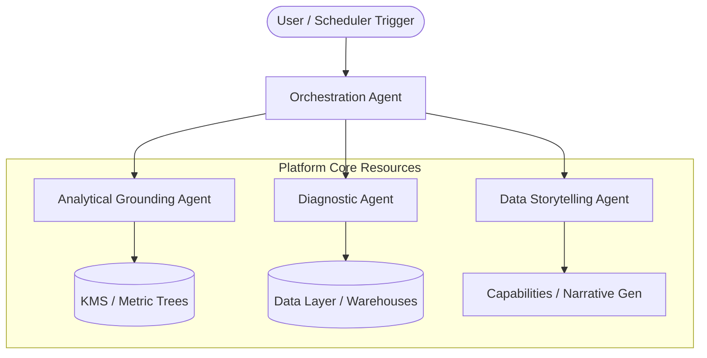

# AIP Agentic Architecture & Orchestration

This document describes the **internal agentic framework** that powers the cognitive operations within the **AIM Intelligence Platform (AIP)**. It outlines the specific roles of our specialized AI analytical agents, their communication protocols, and how they utilize the core layers of the platform.

---

## 🤖 The Analytical Agent Team

AIP uses a multi-agent system where specialized, localized agent personas coordinate to execute workflows. Rather than employing a single massive, monolithic model for everything, we distribute cognitive tasks to dedicated agents:

### 1. The Orchestration Agent (OA)
*   **Location Reference**: Driven by `capabilities/orchestration`
*   **Role**: The conductor of the platform. It accepts user-defined or event-triggered objectives, translates them into a dynamic Directed Acyclic Graph (DAG) of capability executions, routes sub-tasks to specialized agents, and coordinates Human-In-The-Loop approvals.
*   **Responsibility**:
    *   State tracking and session persistence.
    *   Task scheduling and parallel execution management.
    *   Error recovery, fallback routing, and retry loops.

### 2. The Analytical Grounding Agent (AGA)
*   **Location Reference**: Driven by `capabilities/knowledge_retrieval`
*   **Role**: The cognitive gatekeeper of truth. AGA’s sole purpose is to map natural language queries and dynamic calculations to precise business definitions inside the **Knowledge Management System (KMS)**.
*   **Responsibility**:
    *   Mapping ambiguous query strings (e.g., "sales growth") to defined metrics (e.g., `gross_revenue_yoy_growth`).
    *   Validating SQL schemas and analytical equations before database execution.
    *   Enforcing data lineage and structural data governance rules.

### 3. The Diagnostic Agent (DA)
*   **Location Reference**: Driven by `capabilities/metric_interpretation`
*   **Role**: The detective. When an anomaly is detected or an ad-hoc query requires deep investigation, the Diagnostic Agent performs multidimensional statistical scans.
*   **Responsibility**:
    *   Automated slice-and-dice checks across multiple dimensions (geography, platform, user segment).
    *   Variance contribution analysis (identifying which components of a metric DAG drove the parent shift).
    *   Correlation tracking across different metric trees.

### 4. The Data Storytelling Agent (DSA)
*   **Location Reference**: Driven by `capabilities/narrative_generation`
*   **Role**: The communicator. DSA takes raw numbers, statistical trends, and charts, and synthesizes them into highly polished, contextually relevant business narratives tailored to the reader's role.
*   **Responsibility**:
    *   Writing concise, jargon-free executive summaries.
    *   Tailoring narrative length and complexity (e.g., detailed PDF report vs. compact Slack notification).
    *   Ensuring narrative points link directly back to verified data metrics (avoiding hallucinations).

---

## 💬 Communication Protocol: Agent-to-Agent & Model Context Protocol (MCP)

To maintain strict boundaries, agents in AIP do not call each other directly via random scripting. They utilize a standardized communication pattern:

1.  **JSON-Schema Contracts**: All payloads sent between agents are strictly validated against JSON-Schema files defined in the respective `capabilities/` folders.
2.  **Model Context Protocol (MCP)**: AIP standardizes on MCP for external tooling. Internal agents can expose their skills as MCP Tools, and can leverage external MCP Servers to interact with tools (e.g., querying GitHub, sending messages to Slack, fetching CRM data).

---

## 🔒 Security & Guardrails

To operate safely in enterprise environments, our agents are restricted by three primary guardrails:

*   **Execution Isolation**: Agents can never execute raw SQL or shell commands that have not been compiled, validated, and approved by the platform's security layers.
*   **KMS Grounding Policy**: Prompt templates are strictly modularized. Agents are not allowed to invent metric calculation logic or assume business definitions. They must pull definitions directly from the KMS context.
*   **Zero-Trust Session Boundaries**: When an agent executes a workflow, it inherits the exact database access permissions of the triggering user or Service Account. Agents cannot perform privilege escalation.
