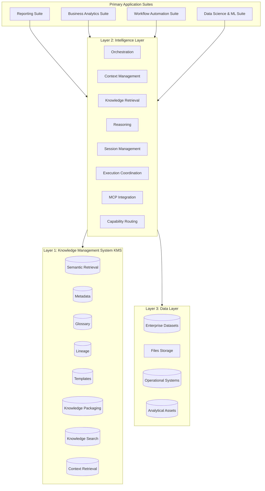

# AIM Intelligence Platform (AIP)

## 📌 Executive Summary

**AIM Intelligence Platform (AIP)** is an enterprise-grade, unified analytics intelligence platform engineered specifically for analytics professionals. AIP acts as the cognitive layer of the modern data stack, bridging the gap between raw data warehouses, structured organizational knowledge, and automated decision workflows. 

AIP is designed to improve analytics productivity, standardize analytical execution, reduce manual effort, improve insight generation quality, and increase institutional knowledge reuse. 

AIP is **NOT** a simple chatbot, a generic BI dashboard, a single workflow application, or a pure retrieval system. It is a highly modular, extensible analytics intelligence platform built upon version-controlled knowledge-grounded execution.

---

## 🏗️ Platform Suites & Products

AIP organizes its user-facing products and workflows into four primary suites:

### 1. Reporting Suite
*Modernize the reporting lifecycle across the enterprise.*
*   **PRISM**: Report inventory intelligence, duplicate report detection, usage analysis, and overlap analysis.
*   **Report Building**: Automated report generation, narrative assistance, standards enforcement, and report quality checks.
*   **Conversational BI**: Natural language analytics, KPI explanation, analytical questioning, and insight retrieval.
*   **Proactive Insights**: Automatic anomaly detection, trend detection, recommendation generation, and proactive monitoring.

### 2. Business Analytics Suite
*Accelerate analytical execution and exploratory insight discovery.*
*   **Insight Discovery**: Automated analytical exploration, trend discovery, and material insight surfacing.
*   **Root Cause Analysis (RCA)**: Driver identification, structural decomposition, and variance contributor analysis.
*   **What-if Analysis**: Dynamic scenario analysis, Monte Carlo simulation, and parameter sensitivity analysis.
*   **Business Narratives**: High-quality executive summaries, data-backed analytical storytelling, and tailored business communication.

### 3. Workflow Automation Suite
*Operationalize analytics execution and automate repeated workflows.*
*   **Workflow Design**: Visual and code-based creation and configuration of analytical execution DAGs.
*   **Workflow Orchestration**: Multi-step task coordination, dynamic variables routing, and execution management.
*   **Task Automation**: Repetitive task scheduling, automated alert processing, and Human-in-the-Loop (HITL) approval routing.
*   **Monitoring**: Real-time pipeline visibility, execution tracking (duration, cost, tokens), and notification dispatches.

### 4. Data Science & ML Suite
*Support model lifecycle activities in a governed, knowledge-integrated environment.*
*   **Data Preparation**: KMS-aligned profiling, transformation, feature engineering, and value validation.
*   **Model Development**: Hyperparameter experimentation, model training pipelines, and statistical evaluation.
*   **Model Documentation**: Metadata logging, automated compliance/governance artifact generation.
*   **Model Pulse**: Periodic validation of predictions against ground truth, feature drift detection, and health monitoring.

---

## 📐 Foundational Layers

AIP's architecture separates execution, reasoning, and semantic knowledge into three modular layers:



### 1. Knowledge Management System (KMS)
Provides the unified institutional knowledge foundation that powers all suites. Grounded in git-managed declarative files representing metrics trees, data lineages, glossaries, and templates.

### 2. Intelligence Layer
Provides the shared platform intelligence, reasoning patterns, cognitive routing, session tracking, and external Model Context Protocol (MCP) integrations.

### 3. Data Layer
Provides secure analytical data access to enterprise datasets, files, operational systems, and analytical assets. Highly secure, internal, and **requires no external third-party integrations**.

---

## 📐 Core Architecture & Design Principles

*   **Platform First, Products Second**: Core architectures must be built as shared resources, not custom utilities for a single product.
*   **Modular Architecture**: Clean folder structures, strict importation guidelines, and decoupled modules.
*   **Shared Capabilities Preferred**: Avoid duplicate implementations. Workflows compose shared capabilities, which remain stateless and avoid workflow ownership.
*   **Knowledge-Grounded Execution**: Analytical actions are bound by metrics trees and glossary terms in the KMS, eliminating LLM hallucinations.
*   **Separation of Concerns**: Strict delineation between: `workflows` $\rightarrow$ `capabilities` $\rightarrow$ `knowledge` $\rightarrow$ `intelligence` $\rightarrow$ `data`.
*   **Configuration over Hardcoding**: Drive platform execution dynamically using declarative, version-controlled parameters.

---

## 📅 Platform Build Sequence

The development of AIP is governed by this precise 10-step build sequence:

1.  **Platform Foundation**: Establish shared utilities, connection pools, standard telemetry, and base classes.
2.  **KMS Integration**: Implement semantic metrics compilation, lineage evaluation, and search APIs.
3.  **Intelligence Layer**: Build reasoning engines, session tracking, routing pipelines, and prompt structures.
4.  **Capability Framework**: Implement the 8 core capabilities (`knowledge_retrieval`, `context_management`, etc.).
5.  **Reporting Suite**: Implement stateful workflows for PRISM, Report Builder, Conversational BI, and Proactive Insights.
6.  **Business Analytics Suite**: Implement exploratory canvas, RCA drivers, and simulation pipelines.
7.  **Data Science & ML Suite**: Implement profiling, experiment trackers, and Model Pulse drift monitors.
8.  **Workflow Automation Suite**: Implement workflow builders, execution schedulers, and incident alert systems.
9.  **Hardening**: Implement row-level tenant security, audit logs, and hallucination-preventing validation gates.
10.  **Platformization**: Finalize the unified visual `/ui` shell, auth layers, deployment manifests, and documentation.

---

## 📂 Repository Structure

```text
├── .codex/                   # Cognitive index and developer agent guidelines
├── capabilities/             # Stateless, reusable capability contracts and implementations
├── docs/                     # Detailed product vision, glossary, and catalogs
├── infra/                    # IaC, Docker, k8s, and deployment manifests
├── knowledge/                # Git-versioned metrics trees, semantic schemas, and metadata
├── platform-core/            # Shared DB drivers, telemetry, security and protocol handlers
├── ui/                       # Unified React/Next.js single-page visual shell
└── workflows/                # Stateful end-to-end analytical pipelines
```

---

## ✅ Definition of Done (DoD)

A task or pull request is considered fully complete only when:
*   **Code Builds**: Compiles without errors or lint warnings.
*   **Tests Pass**: Verification scripts pass successfully.
*   **Documentation Updated**: READMEs and catalog indices are fully synchronized.
*   **No Duplicate Logic**: Common logic is extracted to shared capabilities.
*   **Architecture Principles Maintained**: Directional import structures are fully respected.
*   **Capabilities Reusable**: Capabilities remain stateless and decoupled.
*   **Platform Modular**: Platform maintains clean encapsulation of worries.

---

💼 *AIM Intelligence Platform (AIP) — Powering the next generation of analytics intelligence.*
