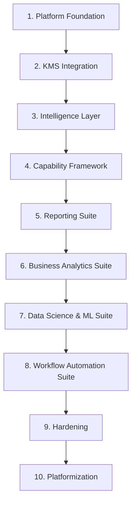

# System Requirements Specification: AIM Intelligence Platform (AIP)

## 📌 Document Purpose
This document provides the exhaustive, **build-ready technical and business specifications** for the AIM Intelligence Platform (AIP). It translates the platform vision into concrete data models, capability contracts, execution flows, and engineering sequences. 

You can feed this document directly into a code-generation agent (or use it as an engineering blueprint) to build the platform step-by-step.

---

## 📂 1. Repository Structure & Directory Scopes

AIP is organized as a modular, single-platform codebase. Workflows, capabilities, knowledge grounding, UI, and infrastructure are strictly separated.

```text
aim-intelligence-platform/
├── platform-core/  # Shared libraries, caching adapters, telemetry, security, LLM wrappers.
├── capabilities/   # Stateless, reusable atomic cognitive and analytical functions.
├── workflows/      # Stateful business process engines and DAG pipelines.
├── knowledge/      # Semantic definitions, metric trees, catalogs, and glossary.
├── ui/             # Unified web-application shell and dashboards canvas.
├── infra/          # Infrastructure configurations, docker compose, and local setups.
├── docs/           # Product vision, catalog, architecture principles, and specs.
└── .codex/         # Metadata, agent guidelines, and system indices.
```

---

## 🏗️ 2. Core Architectural Principles

All code implementations must adhere strictly to these principles:

1.  **Platform First, Products Second**: Core infrastructures and capabilities must be designed as reusable shared platforms, rather than custom logic for a single suite or product.
2.  **Modular Architecture**: Components must have clean boundaries, zero-trust dependencies, and decoupled importation profiles.
3.  **Shared Capabilities Preferred**: Avoid duplicate implementations. If multiple workflows require a logical utility, it must reside inside `/capabilities/`.
4.  **Capabilities Remain Reusable**: Capabilities are strictly stateless and must not contain workflow-specific trigger or persistence logic.
5.  **Workflows Consume Capabilities**: Stateful orchestrations are represented under `/workflows/` and compose stateless capabilities.
6.  **Centralized Knowledge Grounding**: All intelligence or text generation operations must query `/knowledge/` via the centralized retrieval layer to fetch truth definitions.
7.  **Separation of Concerns**: Strict boundary tracking: `workflows` $\rightarrow$ `capabilities` $\rightarrow$ `knowledge` $\rightarrow$ `intelligence` $\rightarrow$ `data`.
8.  **Configuration over Hardcoding**: Use declarative YAML/JSON files inside `/knowledge/` and `/infra/` to drive program logic dynamically.
9.  **Extensibility**: Standardize on pluggable modules and Model Context Protocol (MCP) integrations to register new capabilities.

---

## 📅 3. Technical Build Sequence

The development of AIP must follow this exact 10-step build sequence:



### 1. Platform Foundation
*   Establish common workspace configurations, base agent definitions, secure SQLite/PostgreSQL connection pools, standard telemetry (OpenTelemetry), and telemetry instrumentation.

### 2. KMS Integration
*   Implement the semantic metrics tree validation compiler and the memory lookup and evaluation APIs inside `platform-core/` to read `/knowledge/` configurations.

### 3. Intelligence Layer
*   Build the core reasoning systems, prompt packaging schemas, session management tables, and dynamic capability routing logic.

### 4. Capability Framework
*   Implement the stateless code for the 8 core capabilities: `knowledge_retrieval`, `context_management`, `narrative_generation`, `summarization`, `metric_interpretation`, `visualization`, `orchestration`, and `mcp_integration`.

### 5. Reporting Suite
*   Implement the stateful workflows for **PRISM** (report rationalization), **Report Building**, **Conversational BI**, and **Proactive Insights**.

### 6. Business Analytics Suite
*   Implement the stateful workflows for **Insight Discovery**, **Root Cause Analysis (RCA)**, **What-if Analysis**, and **Business Narratives**.

### 7. Data Science and ML Suite
*   Implement the stateful workflows for **Data Preparation**, **Model Development**, **Model Documentation**, and **Model Pulse**.

### 8. Workflow Automation Suite
*   Implement the stateful workflows for **Workflow Design**, **Workflow Orchestration**, **Task Automation**, and **Monitoring**.

### 9. Hardening
*   Enforce security rules, audit logs, caching parameters, and row-level multi-tenant filters. Verify grounding correctness to block LLM hallucinations.

### 10. Platformization
*   Release the unified `/ui` shell with consistent dynamic navigation and shared auth, final packaging of deployment charts under `/infra/`, and complete onboarding manuals.

---

## 🔒 4. Non-Functional Requirements (NFR)

*   **Scalability**: The orchestration engines inside `/workflows/` must support parallel task executions using asynchronous worker pools.
*   **Maintainability**: Decoupled structures with strictly typed inputs/outputs (Typescript interfaces/Python Pydantic schemas) for all capabilities.
*   **Observability**: Exhaustive trace logs for every step inside a workflow DAG execution, recording duration, cost, and errors to standard OpenTelemetry outputs.
*   **Reliability**: Automatic retries, progressive backoffs, and execution failovers for all capability routers.
*   **Governance Alignment**: Strict metric grounding. Prompts or calculations are blocked if they do not reconcile with metric schemas in KMS.
*   **Extensibility**: Expose pluggable adapters conforming to the Model Context Protocol (MCP) to register custom external suites.
*   **Traceability**: Complete lineage mappings from raw database queries up to the generated narrative sentences.
*   **Enterprise Security Readiness**: Role-based access controls, TLS parameters, encryption-at-rest configurations, and no third-party integrations outside the secure network boundary.

---

## 🎨 5. User Experience & The Unified Shell

AIP is a single platform integrated into a **Unified Shell** UI.
*   **Consistency**: A static left-hand side workspace navigation panel with shared authentication tokens and uniform layout frames.
*   **Navigation Nodes**:
    *   `/reporting` -> Interface for PRISM audits, report builder, Conversational BI chat, and alerts.
    *   `/analytics` -> Dimensional slice-and-dice canvas, RCA breakdowns, and simulation panels.
    *   `/automation` -> Drag-and-drop workflow designer, execution activity grid, and logs feed.
    *   `/data-science` -> Feature profiling sheets, experiment tables, model registry, and performance drift graphs.
*   **Workspace Framework**: A shared context that syncs selected metrics, timeframes, and active filters as users navigate across the suites.

---

## ✅ 6. Definition of Done (DoD)

A component or feature is considered "Done" and ready for production only when:

*   **Code Builds**: Fully compiles without syntax, type, or lint errors.
*   **Tests Pass**: Exhaustive unit tests and integration tests achieve at least 85% coverage. KMS trees are validated against schema constraints.
*   **Documentation Updated**: Standard READMEs inside modified capabilities/workflows and global catalogs are updated in sync.
*   **No Duplicate Logic**: Code complies with "Shared Capabilities Preferred"; utilities are refactored out of workflows into capabilities.
*   **Architecture Principles Maintained**: directional imports rules are validated (workflows $\rightarrow$ capabilities $\rightarrow$ knowledge).
*   **Capabilities Reusable**: Capabilities are stateless and decoupled.
*   **Platform Remains Modular**: No hardcoded frameworks or hard couplings are introduced.
